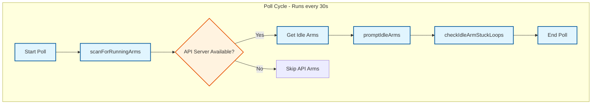
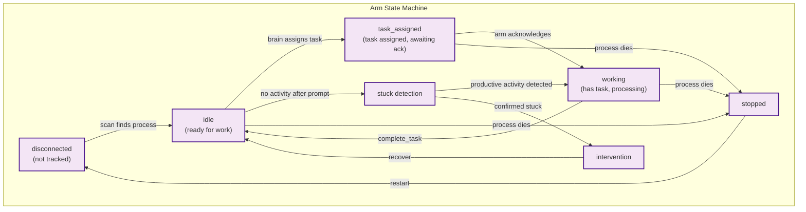
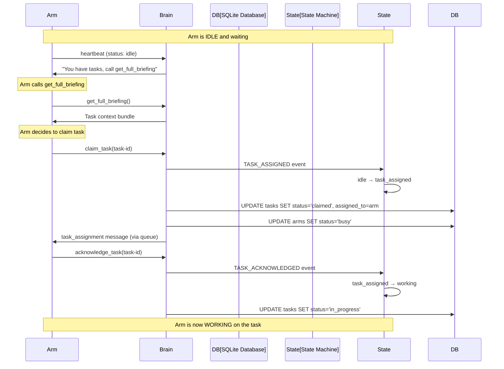
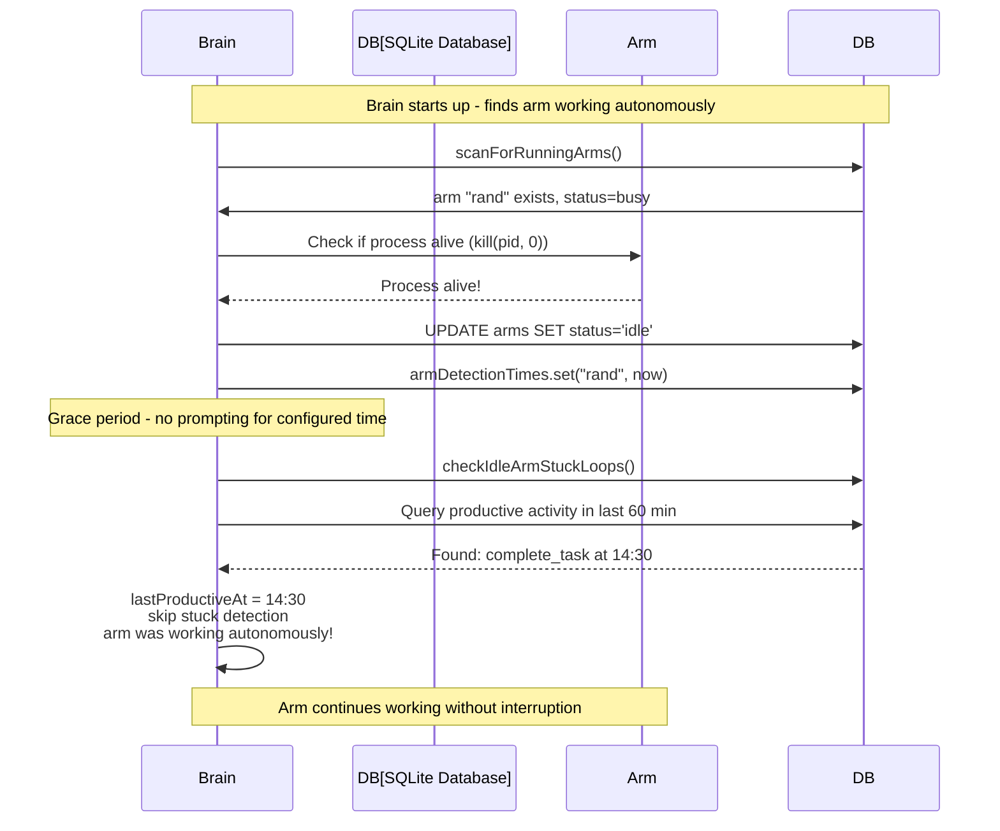

# Components

The Coleo system consists of five major components that work together.

## Brain (Coordinator)

The Brain is the central nervous system of Coleo.

```
┌─────────────────────────────────────────────────────────────┐
│                         BRAIN                                │
├─────────────────────────────────────────────────────────────┤
│  Responsibilities:                                           │
│  ├── Arm Lifecycle      - Spawn, monitor, kill arms         │
│  ├── Conflict Resolution - Mediate ownership disputes        │
│  ├── Governance         - Process proposals, enforce rules   │
│  ├── Human Interface    - Route approvals, notifications     │
│  ├── State Management   - Persist system state               │
│  └── Misbehavior Detection - Identify and stop bad actors   │
├─────────────────────────────────────────────────────────────┤
│  Powers:                                                     │
│  ├── PAUSE arm          - Temporarily halt an arm            │
│  ├── KILL arm           - Terminate destructive arm          │
│  ├── VETO proposal      - Override arm consensus             │
│  └── ESCALATE to human  - Require human decision             │
└─────────────────────────────────────────────────────────────┘
```

### Misbehavior Detection

The Brain monitors arms for problematic behavior:

| Behavior | Detection | Response |
|----------|-----------|----------|
| Touching files outside task scope/claims | Pattern matching on file paths vs. claims | WARN, then PAUSE |
| Ignoring consensus without override | Proposal tracking | WARN, reputation penalty |
| Destructive changes | Pattern matching (rm -rf, DROP, etc.) | KILL immediately |
| Resource exhaustion | Token/API call counters | PAUSE, notify human |
| Stuck in loop | Action repetition detection | PAUSE with exponential backoff |

### Loop Detection & Backoff Throttling (Design)

When an arm gets stuck in a loop (repeating the same actions, hitting the same errors, or consuming tokens without progress), the brain intervenes with an escalating backoff strategy:

```typescript
interface LoopDetection {
  armId: string;
  detectedAt: Date;
  loopType: "action_repeat" | "error_loop" | "token_burn" | "thrashing";
  consecutiveLoops: number;      // How many times we've caught this arm looping
  backoffMinutes: number;        // Current pause duration
}

const BACKOFF_SCHEDULE = [
  1,    // First loop: 1 minute pause
  5,    // Second: 5 minutes
  15,   // Third: 15 minutes
  30,   // Fourth: 30 minutes
  60,   // Fifth+: 1 hour
];
```

**Loop Response Protocol:**

1. **Detect**: Brain notices arm repeating actions or burning tokens without progress
2. **Pause**: Arm is immediately paused (cannot consume more tokens)
3. **Instruct**: Brain sends message: "You appear stuck. Compact your session and reassess."
4. **Wait**: Arm remains paused for backoff duration
5. **Resume**: After backoff, arm is resumed with instruction to compact context and retry
6. **Check Relevance**: If original task is no longer relevant, arm is reassigned

```typescript
interface LoopRecoveryMessage {
  type: "loop_recovery";
  armId: string;
  instruction: string;
  actions: ("compact_session" | "reassess_task" | "request_help")[];
  originalTaskStillRelevant: boolean;
  pauseDuration: number;
}
```

**Token Budget Protection (Design):**

```typescript
interface TokenThrottle {
  windowMinutes: number;         // Rolling window (default: 10)
  maxTokensPerWindow: number;    // Hard cap (default: 50000)
  warningThreshold: number;      // Warn at 70%
}
```

### Brain State

```typescript
interface BrainState {
  status: "running" | "stopped" | "paused";
  startedAt: Date;
  lastPollAt: Date;
  pollIntervalMs: number;
  activeArms: string[];
  pendingProposals: number;
  pendingApprovals: number;
}
```

## Brain Logic

The brain runs a polling cycle every 30 seconds that orchestrates arm lifecycle and task assignment. It includes event-window based arm health monitoring and automatic intervention capabilities.

### Poll Cycle



### Event-Window Based Health Monitoring

The brain continuously monitors arm health using an event-window based system that analyzes recent activity patterns to detect issues before they become critical.

#### Event Window Analysis

The health monitoring system fetches event windows for each arm from JetStream, grouping events by type and analyzing patterns to classify arm states:

```typescript
interface ArmActivityState {
  productive: "actively doing useful work";
  idle: "waiting for work";
  waiting_permission: "blocked on a permission request";
  looping: "stuck in a repetitive pattern";
  silent: "no events for an extended period";
  error: "encountered an error state";
  starting: "in startup grace period";
}
```

#### Health Monitoring Components

1. **BrainEventWindow**: Centralized JetStream event window fetcher that retrieves event slices per arm
2. **ArmActivityAnalyzer**: Classifies arm states based on event windows using pattern recognition
3. **ArmHealthMonitor**: Coordinates health checks and automatic interventions

#### Automatic Intervention Capabilities

When issues are detected, the health monitoring system can automatically intervene:

- **Prompting**: Send messages to arms that appear stuck or idle
- **Interrupting**: Send /compact commands to arms stuck in loops
- **Killing**: Terminate arms that are consistently problematic
- **Escalating**: Notify humans for permission requests that timeout
- **Recovering**: Restart arms that crash or become unresponsive

#### Configuration Options

The health monitoring system is highly configurable:

```typescript
interface HealthMonitorConfig {
  checkIntervalMs: number;      // How often to run health checks
  eventWindowMs: number;        // Size of event window to analyze
  autoInterventionEnabled: boolean; // Whether automatic interventions are enabled
  silentThresholdMs: number;    // Time before arm considered silent
  loopRepetitionThreshold: number; // Repetitions before considering looping
  permissionEscalationMs: number; // Time before escalating permission requests
}
```

### File Reading During Poll

The brain reads markdown files during its poll cycle to sync tasks from human-editable sources:

```
Poll Cycle File Reading:
├── Step 8: syncPlanTasks()
│   └── Reads .project/plan.md
│   └── Extracts tasks from `- [ ]` checkbox items
│   └── Creates/updates tasks in SQLite
│
├── Step 8a: processInbox()
│   └── Reads .project/inbox.md
│   └── Parses ## headers and - [ ] items as new tasks
│   └── Deduplicates against existing tasks (by title similarity)
│   └── Clears inbox after processing
│
├── Step 8b: checkDocUpdateTrigger()
│   └── Checks if documentation needs updating
│
└── Step 8c: reEvaluatePlanProgress()
    └── Creates verification tasks for issues
```

**Files the brain reads:**
- `.project/plan.md` - Main plan with phases and deliverables
- `.project/inbox.md` - Quick task input (cleared after processing)
- `**/*.plan.md` - Any file ending in .plan.md
- `**/plans/*.md` - Files in plans/ directories

### Arm State Machine

Arms follow a formal state machine with 7 states:



### State Transition Truth Table

| From State | Event | To State | Notes |
|------------|-------|----------|-------|
| spawning | PROCESS_STARTED | starting | Process is running |
| starting | HARNESS_CONNECTED | idle | Harness ready |
| idle | TASK_ASSIGNED | task_assigned | Brain assigns task |
| task_assigned | TASK_ACKNOWLEDGED | working | Arm accepts task |
| task_assigned | TIMEOUT (3min) | idle | Arm didn't ack, release task |
| working | TASK_COMPLETED | idle | Task done |
| working | TASK_FAILED | idle | Task failed |
| idle/working | CONNECTION_LOST | disconnected | Network issue |
| disconnected | CONNECTION_RESTORED | previous | Reconnected |
| any | STOP | stopped | Intentional stop |

### Task Reordering and Management

Tasks now include a `sort_order` field that allows manual reordering:

```http
POST /api/tasks/reorder
{
  "taskId": "task-123",
  "toSortOrder": 0  // 0=top, -1=bottom
}
```

Tasks can also be removed directly from plan.md files:

```http
POST /api/tasks/:id/remove-from-plan
```

This links plan.md lines to tasks via `plan_line_uid` and removes both the line and the database entry.

### Task Assignment Flow



**Key insight:** The brain assigns tasks to arms in `idle` state, transitioning them to `task_assigned`. The arm must then explicitly acknowledge to transition to `working`. This two-step process ensures both brain and arm agree on task ownership.

### Grace Period for Autonomous Arms

When the brain starts up and finds arms that were working autonomously (before the brain was running), it protects them from being interrupted:



**Grace period behavior:**
- Arms detected during `scanForRunningArms()` are not prompted for a configurable grace period
- Default: **5 minutes**
- Configurable via `brain.arm_grace_period_minutes` in config.toml
- The brain also checks for recent productive activity (heartbeat, claim_task, complete_task) before marking an arm as stuck

### Stuck Loop Detection

The brain detects when arms repeatedly respond with "idle" without productive work:

1. **Idle arm prompting**: Brain prompts idle arms to check for work
2. **Activity tracking**: Recent activity is analyzed for prompt-response patterns
3. **Productive actions**: heartbeat, claim_task, acknowledge_task, complete_task, file_changed, tool_call
4. **Escalation**: If arm doesn't respond productively:
   - Level 0: Interrupt + different prompt
   - Level 1: Force context compaction
   - Level 2: Kill and respawn arm
   - Level 3: Notify human via email

---

## Arms (General-Purpose Agents)

Each arm is a semi-autonomous **general-purpose** AI agent. Its behavior is determined by the **task classification** it is executing (architect, development, QA, documentation, etc.), not by a permanently assigned domain.

### Arm Profile

```typescript
interface ArmProfile {
  id: string;
  name: string;
  agent: "opencode-api" | "custom";

  // Task execution
  supportedClassifications: string[]; // e.g., ["architect", "development", "qa"]

  // Context Management
  contextBudget: ContextBudget;
  currentContext: ContextSnapshot;

  // Ownership
  claims: FileClaim[];         // Files/dirs this arm is tending

  // Governance
  reputation: number;          // 0-100, affects persuasion weight
  activeProposals: Proposal[];

  // State
  status: "idle" | "working" | "blocked" | "proposing" | "paused" | "dead";
  currentTask?: Task;
}
```

Arms can be used for different task classifications over time. The same arm might run an architect task for one assignment, then a development or QA task for the next.

### MCP Server Catalog

Arms access the garden through MCP servers. Each provides specialized capabilities:

| MCP Server | Purpose | Key Tools |
|------------|---------|-----------|
| `git-mcp` | Version control | `commit`, `push`, `branch`, `diff`, `log` |
| `env-mcp` | Environment variables | `get`, `set`, `list` (filtered for secrets) |
| `docs-mcp` | Library documentation | `search`, `fetch`, `summarize` |
| `devtools-mcp` | Browser automation | `screenshot`, `console`, `network`, `lighthouse` |
| `deploy-mcp` | Deployment operations | `request`, `status`, `rollback`, `logs` |
| `db-mcp` | Database operations | `query`, `migrate`, `seed`, `backup` |
| `pkg-mcp` | Package management | `install`, `update`, `audit`, `outdated` |
| `observability-mcp` | Logs & metrics | `logs.search`, `metrics.query`, `traces.find` |
| `alerts-mcp` | Alert management | `list`, `ack`, `silence`, `escalate` |

### Observability MCP Server

For production operations, arms need visibility into running systems:

```typescript
interface ObservabilityMCP {
  // Log operations
  "logs.search": (params: {
    service: string;
    environment: string;
    query: string;
    timeRange: { start: Date; end: Date };
    limit?: number;
  }) => LogEntry[];
  
  "logs.tail": (params: {
    service: string;
    environment: string;
    follow: boolean;
  }) => AsyncIterable<LogEntry>;
  
  // Metrics
  "metrics.query": (params: {
    query: string;              // PromQL or similar
    timeRange: { start: Date; end: Date };
    step?: string;             // e.g., "1m", "5m"
  }) => MetricSeries[];
  
  "metrics.dashboard": (params: {
    name: string;
  }) => DashboardSnapshot;
  
  // Traces (distributed tracing)
  "traces.find": (params: {
    service?: string;
    traceId?: string;
    minDuration?: number;
    error?: boolean;
    limit?: number;
  }) => Trace[];
  
  // Health
  "health.check": (params: {
    service: string;
    environment: string;
  }) => HealthStatus;
}

interface LogEntry {
  timestamp: Date;
  level: "debug" | "info" | "warn" | "error";
  service: string;
  message: string;
  metadata: Record<string, unknown>;
}

interface HealthStatus {
  status: "healthy" | "degraded" | "unhealthy";
  checks: { name: string; status: string; message?: string }[];
  lastCheck: Date;
}
```

### Alerts MCP Server

For incident response and on-call operations:

```typescript
interface AlertsMCP {
  "alerts.list": (params: {
    status?: "firing" | "resolved" | "silenced";
    severity?: "critical" | "warning" | "info";
    service?: string;
  }) => Alert[];
  
  "alerts.ack": (params: {
    alertId: string;
    message: string;
  }) => void;
  
  "alerts.silence": (params: {
    matchers: { label: string; value: string }[];
    duration: string;         // e.g., "2h", "1d"
    reason: string;
  }) => Silence;
  
  "alerts.escalate": (params: {
    alertId: string;
    reason: string;
  }) => void;
  
  "runbook.fetch": (params: {
    alertName: string;
  }) => Runbook;
}

interface Alert {
  id: string;
  name: string;
  severity: "critical" | "warning" | "info";
  status: "firing" | "resolved" | "silenced";
  service: string;
  summary: string;
  firedAt: Date;
  resolvedAt?: Date;
  labels: Record<string, string>;
}
```

### Legacy: Arm Domain Definition

```typescript
interface ArmDomain {
  name: string;
  description: string;
  defaultPatterns: string[];   // Glob patterns for auto-claiming
  mcpServers: string[];        // Which MCP servers this arm can use
}

// Note: ArmDomain reflects an earlier design that relied on static domains.
// In the current design, arms are general-purpose and behavior is primarily
// guided by task classifications, task history, and configuration templates.
```

---

## Garden (Shared Environment)

The Garden is the workspace that arms tend. It's represented as a 3D space for visualization.

### Layers

```
┌─────────────────────────────────────────────────────────────┐
│                       THE GARDEN                             │
├─────────────────────────────────────────────────────────────┤
│  Physical Layer (files, dirs, repos):                        │
│  ├── Source code                                             │
│  ├── Configuration                                           │
│  ├── Documentation                                           │
│  ├── Tests                                                   │
│  └── Build artifacts                                         │
├─────────────────────────────────────────────────────────────┤
│  Logical Layer (exposed via MCP):                            │
│  ├── git-mcp        - VCS operations                         │
│  ├── env-mcp        - Environment variables                  │
│  ├── runtime-mcp    - Node/Python/Bun versions               │
│  ├── docs-mcp       - Library documentation                  │
│  ├── nx-mcp         - Monorepo orchestration                 │
│  ├── devtools-mcp   - Browser automation                     │
│  ├── deploy-mcp     - Deployment per environment             │
│  └── pkg-mcp        - Package management                     │
├─────────────────────────────────────────────────────────────┤
│  Ownership Layer:                                            │
│  ├── Who owns what (claims)                                  │
│  ├── Who touched what recently (activity)                    │
│  └── Conflict zones (multiple claims)                        │
└─────────────────────────────────────────────────────────────┘
```

### 3D Coordinate System (Radial)

Files are positioned in a radial 3D space where **distance from center indicates activity** - frequently touched files appear closer to the center, making the visualization naturally focus attention on what's actively being worked on.

```typescript
interface GardenCoordinate {
  // Radial coordinates
  category: number;    // Angle in degrees (0-360) - which "slice" of the pie
  activity: number;    // Distance from center (0-100) - 0=hot, 100=cold
  depth: number;       // Vertical position (0-100) - stack layer
}

interface GardenNode {
  path: string;
  type: "file" | "directory";
  coords: GardenCoordinate;
  owner?: string;           // Arm ID
  lastTouchedBy?: string;   // Arm ID
  lastTouchedAt?: Date;
  conflictZone: boolean;
}
```

| Axis | Heuristic | Meaning |
|------|-----------|---------|
| **Category (angle)** | File type/category | Each file category gets a slice: UI (0-60°), API (60-120°), DB (120-180°), Infra (180-240°), Tests (240-300°), Docs (300-360°) |
| **Activity (radius)** | Recency & frequency | 0=center=very active, 100=edge=dormant. Based on touches in last 7 days |
| **Depth (vertical)** | Stack layer | 0=frontend/surface, 100=infrastructure/deep |

### Activity Calculation

```typescript
function calculateActivity(path: string, touches: Touch[]): number {
  const now = Date.now();
  const weekMs = 7 * 24 * 60 * 60 * 1000;
  
  // Only consider touches in last 7 days
  const recentTouches = touches.filter(t => 
    now - t.timestamp.getTime() < weekMs
  );
  
  if (recentTouches.length === 0) return 100; // Edge - dormant
  
  // Score based on recency and frequency
  let score = 0;
  for (const touch of recentTouches) {
    const ageMs = now - touch.timestamp.getTime();
    const recencyWeight = 1 - (ageMs / weekMs); // 1.0 for now, 0.0 for week ago
    score += recencyWeight;
  }
  
  // Normalize: more touches + more recent = closer to center
  // Cap at 20 touches for max activity
  const normalized = Math.min(score / 20, 1);
  return Math.round((1 - normalized) * 100); // Invert: 0=active, 100=dormant
}
```

### Visual Effect

In the 3D Garden view:
- **Center cluster**: Files being actively worked on right now
- **Middle ring**: Recently touched, part of ongoing work
- **Outer ring**: Stable files, not recently modified
- **Colored by owner**: Each arm has a color, files glow with owner's color
- **Pulsing**: Files with active claims pulse gently
- **Conflict zones**: Red highlight when multiple arms are contending

---

## Observatory (Web UI + API)

The Observatory is how humans observe and control the system.

### Server Components

```
┌─────────────────────────────────────────────────────────────┐
│                      OBSERVATORY                             │
├─────────────────────────────────────────────────────────────┤
│  Web Server (Hono):                                          │
│  ├── REST API          - CRUD operations, queries            │
│  ├── WebSocket         - Real-time updates                   │
│  ├── Static files      - React SPA                           │
│  └── Push endpoint     - Browser notifications               │
└─────────────────────────────────────────────────────────────┘
```

### UI Views

| View | Purpose |
|------|---------|
| **Dashboard** | System overview, arm status at a glance |
| **Garden** | 3D visualization of workspace with ownership |
| **Arms** | Arm details, context, activity log |
| **Proposals** | Active debates, arguments, signals |
| **Approvals** | Pending human decisions |
| **Activity** | Timeline of all system actions |
| **Config** | System settings, arm configuration |

### Available Actions

- Spawn/Kill arms
- Approve/Reject proposals
- Override arm decisions
- Configure context budgets
- Reassign file ownership
- Trigger deployments

---

## Model Fallback System

The model fallback system ensures arms can spawn successfully even when configured with unavailable models by automatically resolving to alternative models based on availability and cost.

### Model Resolution Process

1. **Exact Match**: Try the requested provider/model combination
2. **Provider Fallback**: If model not found, find cheapest model from same provider
3. **Cross-Provider**: If provider not available, find same model from another provider
4. **Last Resort**: Use first available model from any connected provider

### Model Pricing Information

The resolver includes known model pricing to make cost-based decisions when multiple fallback options are available:

```typescript
interface ModelPricing {
  input: number;   // Price per million input tokens
  output: number;  // Price per million output tokens
}

// Examples of known model pricing:
// Claude Sonnet 4: { input: 3, output: 15 }
// GPT-4o: { input: 2.5, output: 10 }
// Gemini 2.5 Flash: { input: 0.075, output: 0.3 }
```

### Model Resolution Response

```typescript
interface ResolvedModel {
  providerId: string;
  modelId: string;
  providerName: string;
  modelName: string;
  fallback: boolean;
  fallbackReason?: string;
}
```

When a fallback occurs, the system logs the reason for debugging and transparency.

### Provider Availability Checking

The system can validate model availability before spawning arms:

```typescript
async function isModelAvailable(
  providerId: string,
  modelId: string,
  apiUrl: string
): Promise<boolean>
```

### Cost-Based Model Selection

For scenarios where cost optimization is important, the system can provide a list of all available models sorted by cost:

```typescript
async function getAvailableModelsByCost(
  apiUrl: string
): Promise<Array<{ providerId: string; modelId: string; cost: number }>>
```

---
 
## Nerve System (Communication Layer)

All control-plane communication flows through NATS + API boundaries:
- ArmAgent publishes arm events and arm-to-brain messages into NATS/JetStream.
- API server is the typed/authenticated boundary that bridges brain messages into the DB-backed inbox queue.
- Brain consumes inbox/events via API endpoints only.

### Message Flow

```
Human ◄──────► Observatory/UI ◄──────► API Server ◄──────► Brain
                                         │                  │
                                         │ NATS/JetStream   │ API polling
                                         │ + DB inbox       │ + status acks
                                         ▼                  │
                                      ArmAgent ◄────────────┘
                                         │
                                         ▼
                                        Arms
```

### NATS/JetStream Responsibilities

- Durable arm activity/control events for replay and recovery.
- Arm-to-brain message ingress subject (`coleo.brain.messages`).
- Broadcast/lifecycle events for connected system components.

### Brain Inbox Message Types (API Queue)

Only validated, brain-relevant message types are admitted to the inbox queue:

| Message Type | Direction | Description |
|--------------|-----------|-------------|
| `task_assignment` | Brain → Arm | Assign task to arm |
| `task_complete` | Arm → Brain | Task finished successfully |
| `task_validation` / `task_validate` | Arm → Brain | Validation result for a task |
| `task_acknowledge` | Arm → Brain | Arm acknowledged assignment |
| `discovery` | Arm → Brain | Arm found something noteworthy |
| `dependency_discovery` | Arm → Brain | Arm found a dependency |
| `status_report` | Arm → Brain | Progress report on current task |
| `status_update` | Arm → Brain | General status update |
| `heartbeat` | Arm → Brain | Arm is alive and working |
| `approval_request` | Arm → Brain | Arm needs approval for action |
| `share_note` | Arm → Brain | Note shared with coordination context |
| `tool_discovery` | Arm → Brain | Arm found useful tool |
| `doc_update` | Arm → Brain | Documentation signal/update |
| `file_subscription` | Arm → Brain | Arm watching a file |
| `file_change` | Arm → Brain | Watched file changed |
| `bug_report` | Arm → Brain | Bug discovered |
| `bug_claim` | Arm → Brain | Claim/release bug ownership |

Messages outside this contract are rejected and captured in dead-letter records for observability/replay.

### Activity Event Types (JetStream)

Events tracked in JetStream for activity analysis:

| Category | Event Types |
|----------|-------------|
| **Session** | `session.status`, `session.idle`, `session.error`, `session.updated`, `session.diff` |
| **Message** | `message.updated`, `message.removed`, `message.part.updated`, `message.part.removed` |
| **Permission** | `permission.asked`, `permission.replied` |
| **Todo** | `todo.updated` |
| **File** | `file.edited`, `file.watcher.updated` |
| **Command** | `command.executed` |
| **Arm Lifecycle** | `arm.spawned`, `arm.status_changed`, `arm.heartbeat`, `arm.killed`, `arm.stopped` |
| **Task** | `task.created`, `task.assigned`, `task.claimed`, `task.completed`, `task.blocked`, `task.failed` |
| **Brain** | `arm_prompted`, `event-status`, `started`, `stopped` |
