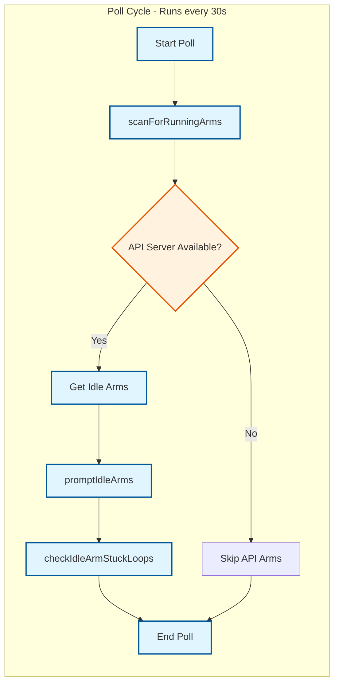
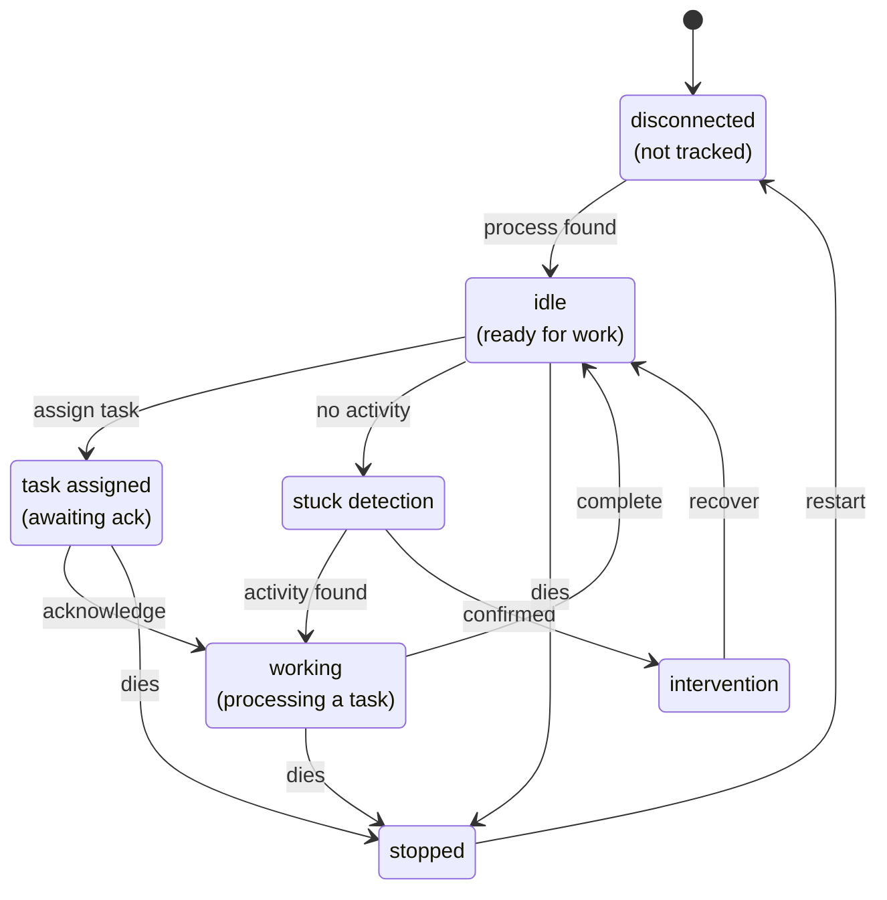
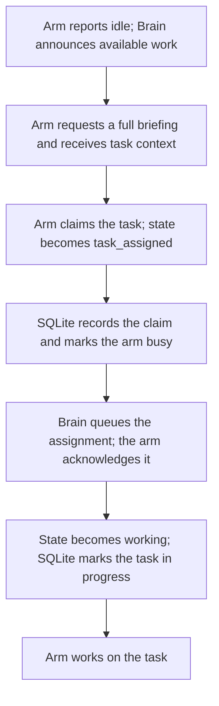
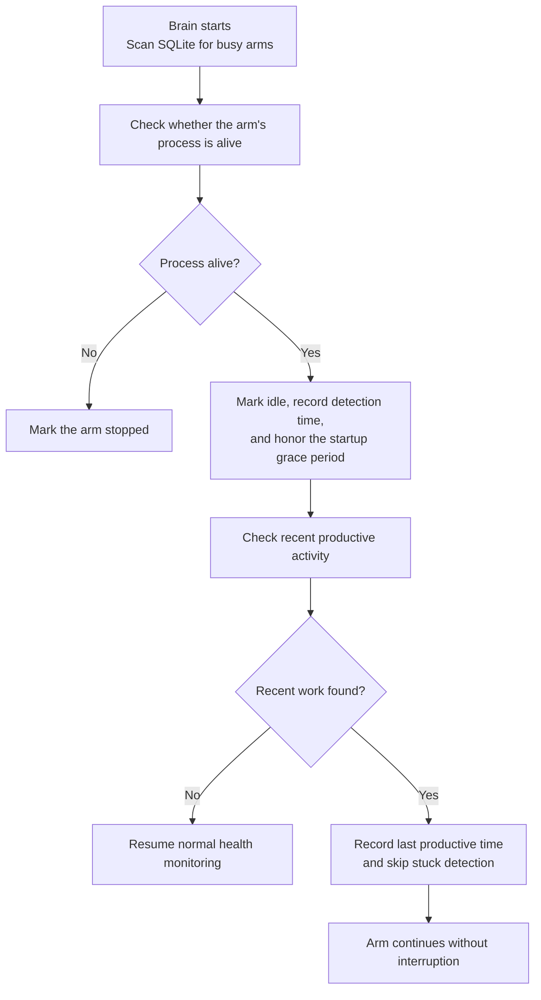

# Brain

The Brain is the central nervous system of Coleo.

```
┌─────────────────────────────────────────────────────────────┐
│                         BRAIN                                │
├─────────────────────────────────────────────────────────────┤
│  Responsibilities:                                           │
│  ├── Arm Lifecycle      - Spawn, monitor, kill arms         │
│  ├── Conflict Resolution - Mediate ownership disputes        │
│  ├── Governance         - Process proposals, enforce rules   │
│  ├── Human Interface    - Route approvals, notifications     │
│  ├── State Management   - Persist system state               │
│  └── Misbehavior Detection - Identify and stop bad actors   │
├─────────────────────────────────────────────────────────────┤
│  Powers:                                                     │
│  ├── PAUSE arm          - Temporarily halt an arm            │
│  ├── KILL arm           - Terminate destructive arm          │
│  ├── VETO proposal      - Override arm consensus             │
│  └── ESCALATE to human  - Require human decision             │
└─────────────────────────────────────────────────────────────┘
```

## Misbehavior Detection

The Brain monitors arms for problematic behavior:

| Behavior | Detection | Response |
|----------|-----------|----------|
| Touching files outside task scope/claims | Pattern matching on file paths vs. claims | WARN, then PAUSE |
| Ignoring consensus without override | Proposal tracking | WARN, reputation penalty |
| Destructive changes | Pattern matching (rm -rf, DROP, etc.) | KILL immediately |
| Resource exhaustion | Token/API call counters | PAUSE, notify human |
| Stuck in loop | Action repetition detection | PAUSE with exponential backoff |

## Loop Detection & Backoff Throttling (Design)

When an arm gets stuck in a loop (repeating the same actions, hitting the same errors, or consuming tokens without progress), the brain intervenes with an escalating backoff strategy:

```typescript
interface LoopDetection {
  armId: string;
  detectedAt: Date;
  loopType: "action_repeat" | "error_loop" | "token_burn" | "thrashing";
  consecutiveLoops: number;      // How many times we've caught this arm looping
  backoffMinutes: number;        // Current pause duration
}

const BACKOFF_SCHEDULE = [
  1,    // First loop: 1 minute pause
  5,    // Second: 5 minutes
  15,   // Third: 15 minutes
  30,   // Fourth: 30 minutes
  60,   // Fifth+: 1 hour
];
```

**Loop Response Protocol:**

1. **Detect**: Brain notices arm repeating actions or burning tokens without progress
2. **Pause**: Arm is immediately paused (cannot consume more tokens)
3. **Instruct**: Brain sends message: "You appear stuck. Compact your session and reassess."
4. **Wait**: Arm remains paused for backoff duration
5. **Resume**: After backoff, arm is resumed with instruction to compact context and retry
6. **Check Relevance**: If original task is no longer relevant, arm is reassigned

```typescript
interface LoopRecoveryMessage {
  type: "loop_recovery";
  armId: string;
  instruction: string;
  actions: ("compact_session" | "reassess_task" | "request_help")[];
  originalTaskStillRelevant: boolean;
  pauseDuration: number;
}
```

**Token Budget Protection (Design):**

```typescript
interface TokenThrottle {
  windowMinutes: number;         // Rolling window (default: 10)
  maxTokensPerWindow: number;    // Hard cap (default: 50000)
  warningThreshold: number;      // Warn at 70%
}
```

## Brain State

```typescript
interface BrainState {
  status: "running" | "stopped" | "paused";
  startedAt: Date;
  lastPollAt: Date;
  pollIntervalMs: number;
  activeArms: string[];
  pendingProposals: number;
  pendingApprovals: number;
}
```

## Brain Logic

The brain runs a polling cycle every 30 seconds that orchestrates arm lifecycle and task assignment. It includes event-window based arm health monitoring and automatic intervention capabilities.

### Poll Cycle



### Event-Window Based Health Monitoring

The brain continuously monitors arm health using an event-window based system that analyzes recent activity patterns to detect issues before they become critical.

#### Event Window Analysis

The health monitoring system fetches event windows for each arm from JetStream, grouping events by type and analyzing patterns to classify arm states:

```typescript
interface ArmActivityState {
  productive: "actively doing useful work";
  idle: "waiting for work";
  waiting_permission: "blocked on a permission request";
  looping: "stuck in a repetitive pattern";
  silent: "no events for an extended period";
  error: "encountered an error state";
  starting: "in startup grace period";
}
```

#### Health Monitoring Components

1. **BrainEventWindow**: Centralized JetStream event window fetcher that retrieves event slices per arm
2. **ArmActivityAnalyzer**: Classifies arm states based on event windows using pattern recognition
3. **ArmHealthMonitor**: Coordinates health checks and automatic interventions

#### Automatic Intervention Capabilities

When issues are detected, the health monitoring system can automatically intervene:

- **Prompting**: Send messages to arms that appear stuck or idle
- **Interrupting**: Send /compact commands to arms stuck in loops
- **Killing**: Terminate arms that are consistently problematic
- **Escalating**: Notify humans for permission requests that timeout
- **Recovering**: Restart arms that crash or become unresponsive

#### Configuration Options

The health monitoring system is highly configurable:

```typescript
interface HealthMonitorConfig {
  checkIntervalMs: number;      // How often to run health checks
  eventWindowMs: number;        // Size of event window to analyze
  autoInterventionEnabled: boolean; // Whether automatic interventions are enabled
  silentThresholdMs: number;    // Time before arm considered silent
  loopRepetitionThreshold: number; // Repetitions before considering looping
  permissionEscalationMs: number; // Time before escalating permission requests
}
```

### File Reading During Poll

The brain reads markdown files during its poll cycle to sync tasks from human-editable sources:

```
Poll Cycle File Reading:
├── Step 8: syncPlanTasks()
│   └── Reads .project/plan.md
│   └── Extracts tasks from `- [ ]` checkbox items
│   └── Creates/updates tasks in SQLite
│
├── Step 8a: processInbox()
│   └── Reads .project/inbox.md
│   └── Parses ## headers and - [ ] items as new tasks
│   └── Deduplicates against existing tasks (by title similarity)
│   └── Clears inbox after processing
│
├── Step 8b: checkDocUpdateTrigger()
│   └── Checks if documentation needs updating
│
└── Step 8c: reEvaluatePlanProgress()
    └── Creates verification tasks for issues
```

**Files the brain reads:**
- `.project/plan.md` - Main plan with phases and deliverables
- `.project/inbox.md` - Quick task input (cleared after processing)
- `**/*.plan.md` - Any file ending in .plan.md
- `**/plans/*.md` - Files in plans/ directories

### Arm State Machine

Arms follow a formal state machine with 7 states:



### State Transition Truth Table

| From State | Event | To State | Notes |
|------------|-------|----------|-------|
| spawning | PROCESS_STARTED | starting | Process is running |
| starting | HARNESS_CONNECTED | idle | Harness ready |
| idle | TASK_ASSIGNED | task_assigned | Brain assigns task |
| task_assigned | TASK_ACKNOWLEDGED | working | Arm accepts task |
| task_assigned | TIMEOUT (3min) | idle | Arm didn't ack, release task |
| working | TASK_COMPLETED | idle | Task done |
| working | TASK_FAILED | idle | Task failed |
| idle/working | CONNECTION_LOST | disconnected | Network issue |
| disconnected | CONNECTION_RESTORED | previous | Reconnected |
| any | STOP | stopped | Intentional stop |

### Task Reordering and Management

Tasks now include a `sort_order` field that allows manual reordering:

```http
POST /api/tasks/reorder
{
  "taskId": "task-123",
  "toSortOrder": 0  // 0=top, -1=bottom
}
```

Tasks can also be removed directly from plan.md files:

```http
POST /api/tasks/:id/remove-from-plan
```

This links plan.md lines to tasks via `plan_line_uid` and removes both the line and the database entry.

### Task Assignment Flow



**Key insight:** The brain assigns tasks to arms in `idle` state, transitioning them to `task_assigned`. The arm must then explicitly acknowledge to transition to `working`. This two-step process ensures both brain and arm agree on task ownership.

### Grace Period for Autonomous Arms

When the brain starts up and finds arms that were working autonomously (before the brain was running), it protects them from being interrupted:



**Grace period behavior:**
- Arms detected during `scanForRunningArms()` are not prompted for a configurable grace period
- Default: **5 minutes**
- Configurable via `brain.arm_grace_period_minutes` in config.toml
- The brain also checks for recent productive activity (heartbeat, claim_task, complete_task) before marking an arm as stuck

### Stuck Loop Detection

The brain detects when arms repeatedly respond with "idle" without productive work:

1. **Idle arm prompting**: Brain prompts idle arms to check for work
2. **Activity tracking**: Recent activity is analyzed for prompt-response patterns
3. **Productive actions**: heartbeat, claim_task, acknowledge_task, complete_task, file_changed, tool_call
4. **Escalation**: If arm doesn't respond productively:
   - Level 0: Interrupt + different prompt
   - Level 1: Force context compaction
   - Level 2: Kill and respawn arm
   - Level 3: Notify human via email
