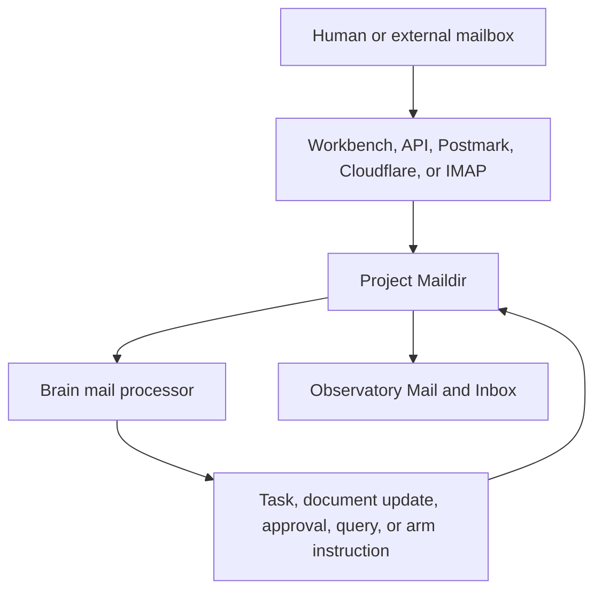

# Mail

Mail gives Coleo a durable, human-readable communication channel. It is useful for instructions and decisions that should survive a browser session, remain inspectable as a thread, and work through familiar external tools.

Unlike transient chat output, project mail is stored in the project's Coleo directory and remains available to the Brain, the API, the Workbench, command-line tools, and optional mail gateways.

## Local Mailboxes

Coleo stores RFC 5322 messages in Maildir folders under `.coleo/mail/`:

- `inbox` for received messages, with archived messages moved into `inbox/archive/YYYY-MM`;
- `sent` for outgoing messages;
- `drafts` for work not yet sent;

Maildir writes through a temporary file and then renames it into place, so a partially written message does not appear as a complete one. Standard flags record whether a message has been seen, replied to, flagged, drafted, or trashed.

## Message Path

The API lists folders and messages, returns raw message content, marks messages as read with the `seen` flag, archives mail, and sends replies. Other flag updates—including clearing `seen`—are not yet implemented. Mail changes are also broadcast on the Workbench's mail channel so open projections can refresh promptly.

## The Workbench Experience

The dedicated Mail route uses the same messaging surface as the unified Inbox, narrowed to project mail. It groups messages into threads and supports inbox, sent, and archived views.

Messages can be opened as adaptive cards or full thread projections. Read, reply, archive, and nested-reply behavior stays attached to the message resource, so the same thread can be opened in another Workbench pane without losing its identity.

## Brain Processing

The Brain can interpret human mail as a task, documentation update, bug report, approval response, query, arm instruction, or escalation. Model-assisted classification is used when available; deterministic fallback parsing keeps basic mail useful when model access is unavailable.

Processing outcomes can be recorded as events, making it possible to trace whether a message created work, unblocked an arm, or was deliberately ignored.

## Gateways

The local Maildir remains the durable center while gateways adapt it to other environments:

- the built-in IMAP server exposes project mail to standard clients;
- Postmark can normalize inbound webhooks and deliver outbound mail;
- Cloudflare Email Sending can deliver outbound messages;
- the REST API and CLI support local automation and inspection.

This keeps the project's communication history locally owned even when an external service transports a message.

For setup details, see the [IMAP Gateway guide](/guides/imap-gateway).
