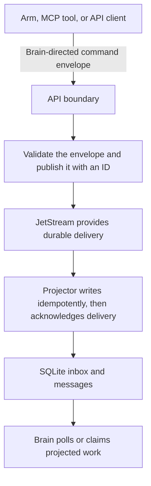

# Message Flow

Coleo does not send every kind of information through one undifferentiated bus. Commands, activity history, browser updates, and human mail have different durability and validation needs, so each uses a path suited to its job.

## Four Communication Paths

| Path | Purpose | Durable authority |
|---|---|---|
| Commands | Directed instructions and results between the Brain and arms | JetStream and targeted NATS subjects, with the Brain inbox projected into SQLite |
| Events | Activity, lifecycle, status, and transcript history | JetStream event stream |
| Browser updates | Prompt refresh signals for open Observatory views | Authenticated WebSocket channels |
| Mail | Human-readable instructions and threaded correspondence | Project Maildir |

The API sits at the boundary between these paths. It validates requests, persists projections, and exposes stable interfaces to the Brain and Observatory.

## Command Flow

Every command envelope has an ID, sender, recipient, type, payload, creation time, and schema version. Commands addressed to the Brain must match its supported message types and payload contracts. Invalid messages are recorded as dead letters instead of being silently accepted. ArmAgent processes also subscribe to targeted command subjects for immediate arm-control actions.

JetStream uses the envelope ID for deduplication, while the database projection is also idempotent. This allows replay and recovery without turning one command into repeated work.

## Event Flow

The event stream records what happened rather than asking another component to do something. Arm lifecycle changes, task activity, status reports, discoveries, bugs, tool activity, and session events can be replayed by health monitors, history views, and indexers.

Durable consumers acknowledge events only after their own work succeeds. A semantic indexer, for example, leaves a failed batch unacknowledged so JetStream can deliver it again.

## Live Browser Updates

WebSocket broadcasts are intentionally lighter. Domain publishers emit changes on channels such as tasks, bugs, brain, arms, activity, mail, and workbench. The browser maintains one authenticated connection and fans those signals out to interested projections.

A WebSocket message tells an open view that something changed; it is not the durable copy of that change. Views refresh from the API, which keeps a disconnected browser from becoming a consistency problem.

## Why the Separation Matters

A command needs strict validation and once-only handling. An event needs replay. A browser needs low-latency notification. A human message needs a readable thread. Keeping those contracts distinct makes failures easier to understand and lets each component recover from its own durable source.
