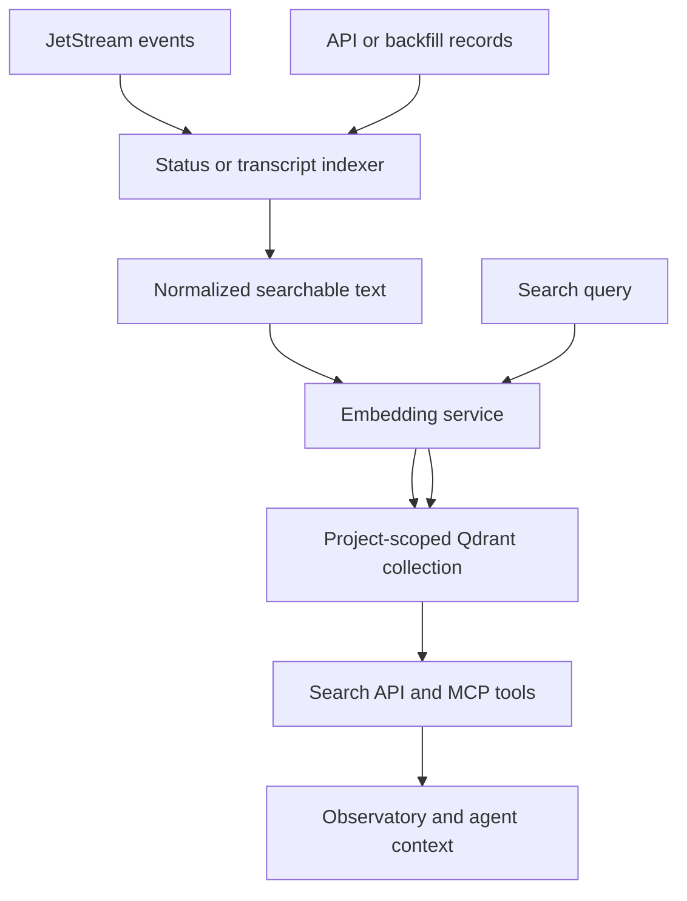

# Qdrant & Indexer

Qdrant is Coleo's optional semantic-memory service. It stores vector representations of project activity so the Brain, arms, API, and Observatory can find earlier work by meaning rather than exact wording.

It is not the system of record. SQLite, JetStream, Maildir, and project files retain the durable source data. Qdrant is a derived index that can be rebuilt.

## Indexing Path

The embedding service can use an OpenAI embedding model, a local Transformers.js model, or a deterministic local fallback for development and tests. Collection dimensions follow the selected provider.

## Project-Scoped Collections

Collection names include a stable key derived from the canonical project directory. That prevents one project's semantic history from leaking into another when several Coleo projects share a Qdrant service.

The primary indexes are:

| Collection | Contents | Main use |
|---|---|---|
| `search-index-<projectKey>` | Transcript-like arm events and explicitly indexed documents | General semantic and hybrid search |
| `status-history-<projectKey>` | Status reports, completions, discoveries, bugs, task changes, and selected arm events | Filtered history search and context recovery |

Payload indexes support filtering by project, arm, event type, task, bug, classification, and time where appropriate.

## The Transcript Indexer

The transcript indexer is a durable JetStream consumer. It listens to arm-event subjects, keeps only events for its project, extracts useful text such as messages, prompts, summaries, errors, and titles, and embeds batches before upserting them into Qdrant.

A point ID is derived from the event stream and sequence, making repeated delivery safe. The indexer acknowledges a batch only after the vector upsert succeeds. If embedding or Qdrant fails, the batch remains available for redelivery instead of disappearing.

## Status-History Indexing

A second pipeline normalizes status reports, task completions, discoveries, bugs, task changes, and arm events into a common searchable event shape. The original event and delivery metadata remain in the payload for inspection.

Retention is based on value: completions, discoveries, and bugs can remain indefinitely, while routine status changes and arm events can expire sooner. Existing SQLite reports can be backfilled into the index with deterministic IDs.

## Search and Graceful Degradation

The search API combines SQLite full-text scores with Qdrant similarity scores. Callers can adjust the keyword and semantic weights or filter history by arm, event type, task, classification, and time.

If Qdrant or the embedding provider is unavailable, general search falls back to keyword-only results. Core coordination continues because semantic indexing is an enhancement, not a prerequisite for task state or messaging.

Operational setup lives in the [Qdrant guide](/guides/qdrant), while request shapes and ranking behavior are documented in the [Search API guide](/guides/search-api).
