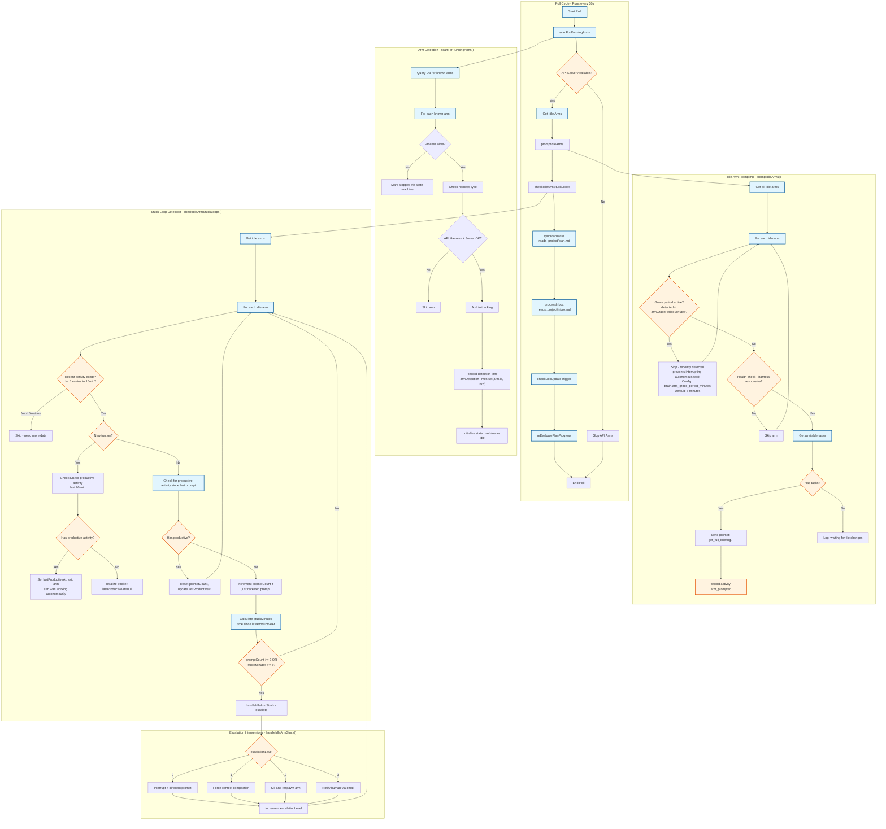
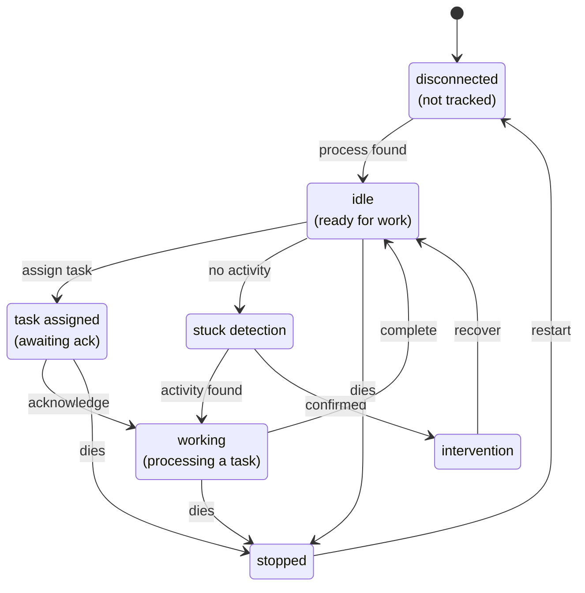
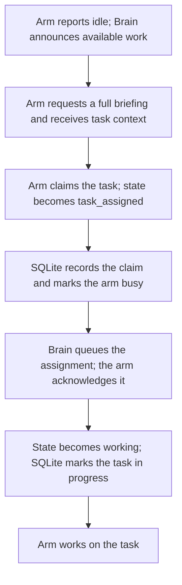
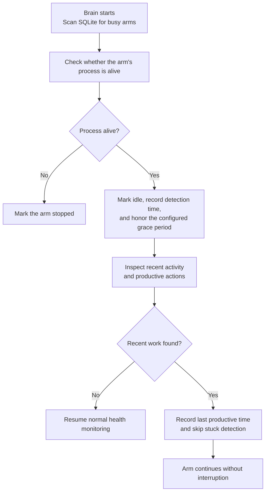

## Overview

The brain runs a polling cycle every 30 seconds that:
1. **Scans** for running arms and adds them to tracking
2. **Prompts** idle arms to check for available work
3. **Detects** stuck loops where arms repeatedly respond with "idle" without productive work



## File Reading Steps

After checking arm status, the brain reads markdown files to sync tasks:

| Step | Function | File(s) Read | Purpose |
|------|----------|--------------|---------|
| 8 | `syncPlanTasks()` | `.project/plan.md` | Extracts `- [ ]` checkboxes as tasks |
| 8a | `processInbox()` | `.project/inbox.md` | Parses `## headers` and `- [ ]` items, creates tasks, clears inbox |
| 8b | `checkDocUpdateTrigger()` | (various) | Checks if docs need updating |
| 8c | `reEvaluatePlanProgress()` | (various) | Creates verification tasks for issues |

**Inbox processing:**
- `## Header` creates task with header as title, following paragraph as description
- `- [ ] Text` creates task with Text as title
- Deduplicates against existing tasks by title similarity
- Clears inbox after processing (goal: inbox always empty after brain poll)

## Arm State Machine



## State Machine Truth Table

| From State | Event | To State | Notes |
|------------|-------|----------|-------|
| spawning | PROCESS_STARTED | starting | Process is running |
| starting | HARNESS_CONNECTED | idle | Harness ready |
| idle | TASK_ASSIGNED | task_assigned | Brain assigns task |
| task_assigned | TASK_ACKNOWLEDGED | working | Arm accepts task |
| task_assigned | TIMEOUT (3min) | idle | Arm didn't ack, release task |
| working | TASK_COMPLETED | idle | Task done |
| working | TASK_FAILED | idle | Task failed |
| idle/working | CONNECTION_LOST | disconnected | Network issue |
| disconnected | CONNECTION_RESTORED | previous | Reconnected |
| any | STOP | stopped | Intentional stop |

**Key insight:** The brain assigns tasks to arms in `idle` state, transitioning them to `task_assigned`. The arm must then explicitly acknowledge (via `acknowledge_task` or `claim_task` tool) to transition to `working`. This two-step process ensures both brain and arm agree on task ownership.

## Autonomous Arm Protection Sequence

This diagram shows the correct task assignment flow:



## Autonomous Arm Protection Flow

When the brain starts up and finds arms that were working autonomously:



## Configuration

The grace period and other brain settings are configurable via:

1. **TOML config file** (`~/.coleo/config.toml`):
```toml
[brain]
poll_interval_ms = 30000        # Poll cycle interval (ms)
max_arms = 8                    # Maximum concurrent arms
arm_grace_period_minutes = 5    # Grace period before prompting newly detected arms
```

2. **Environment variables**:
```bash
OCTOPAI_POLL_INTERVAL_MS=30000
OCTOPAI_MAX_ARMS=8
OCTOPAI_ARM_GRACE_PERIOD_MINUTES=5
```

3. **Database config table**:
```sql
INSERT INTO config (key, value) VALUES
  ('brain_poll_interval_ms', '30000'),
  ('brain_max_arms', '8'),
  ('brain_arm_grace_period_minutes', '5');
```

**Default values:**
- `brain_poll_interval_ms`: 30000 (30 seconds)
- `brain_max_arms`: 8
- `brain_arm_grace_period_minutes`: 5 (minutes)

## Key Design Decisions

### 1. Grace Period for Newly Detected Arms
- Arms detected during `scanForRunningArms()` are not prompted for a configurable grace period
- Default: **5 minutes**
- This prevents interrupting arms that were working autonomously
- Timer starts when `armDetectionTimes.set()` is called
- Config via: `brain.arm_grace_period_minutes` in config.toml, or `OCTOPAI_ARM_GRACE_PERIOD_MINUTES` env var

### 2. Database-Backed Productive Activity Check
- When a new stuck-loop tracker is created, query DB for activity in last 60 minutes
- If productive activity found (heartbeat, claim_task, complete_task, file changes)
- Set `lastProductiveAt` and skip stuck detection
- This prevents false positives for arms that were doing real work

### 3. Productive Actions List
```typescript
const productiveActions = [
  "heartbeat",
  "claim_task",
  "acknowledge_task",
  "complete_task",
  "get_my_instructions",
  "task_progress",
  "file_changed",
  "file_created",
  "file_deleted",
  "tool_call",
];
```

### 4. Escalation Levels
| Level | Action | When Used |
|-------|--------|-----------|
| 0 | Interrupt + different prompt | First stuck detection |
| 1 | Force context compaction | Still stuck after interrupt |
| 2 | Kill and respawn arm | Still stuck after compaction |
| 3 | Notify human via email | Cannot recover automatically |
